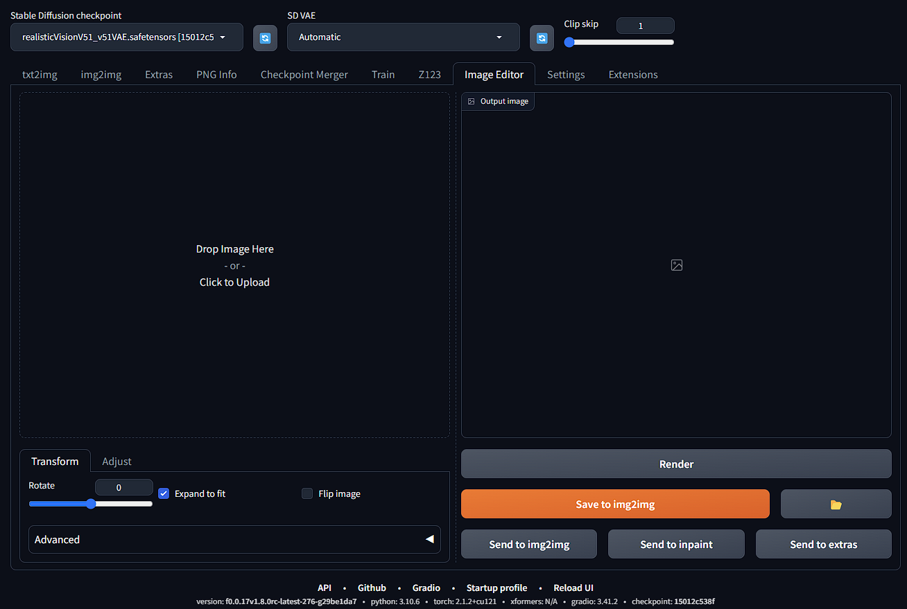
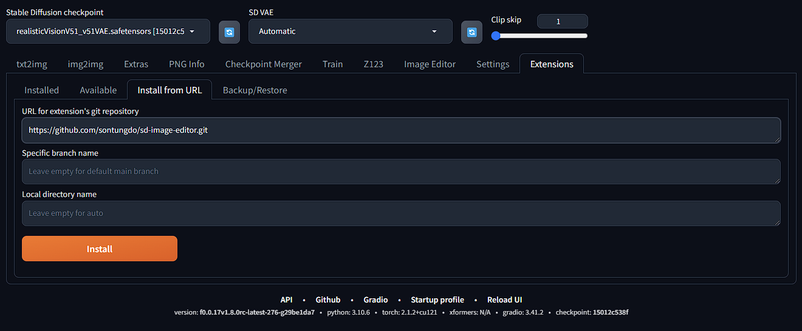
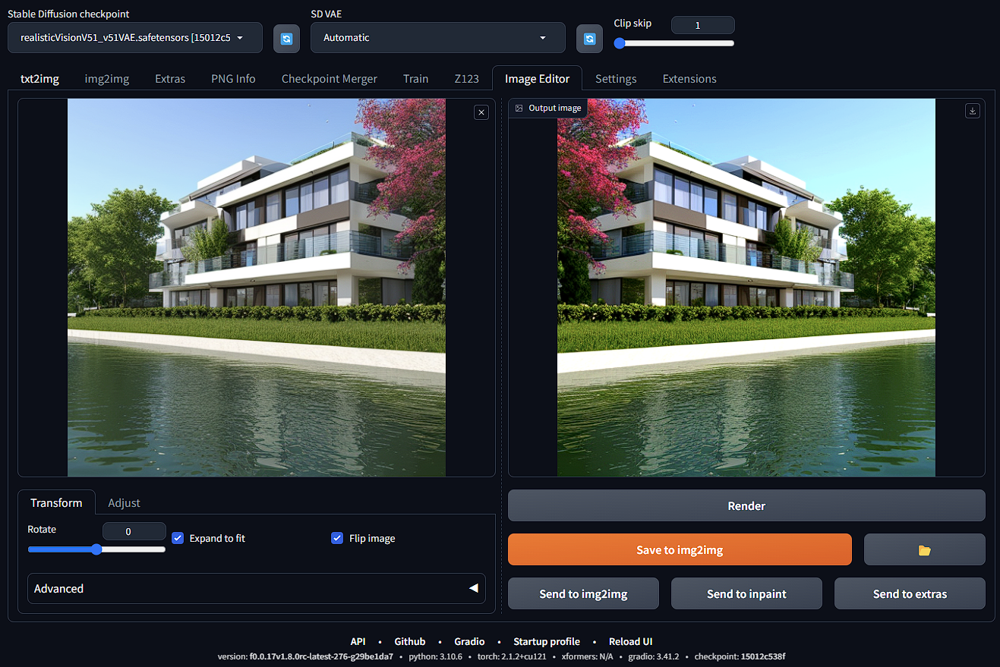

# Image Editor Extension for Stable Diffusion Web UI 
A simple, lightweight, and easy-to-use image editor for [Stable Diffusion Web UI](https://github.com/AUTOMATIC1111/stable-diffusion-webui). 
 
This image editor is natively built for the SD Web UI ecosystem (compatible with Forge) that offers integration with other core functions of SD Web UI to speed up your workflows. Quickly rotate or enhance image colors, then send it to img2img in just a few seconds!
 

## Installation
1. Go to your Web UI: Extensions -> Install from URL
2. Paste `https://github.com/sontungdo/sd-image-editor.git` in the first box
3. Install
 

## Example usage
Flip and adjust color, contrast, brightness
 

