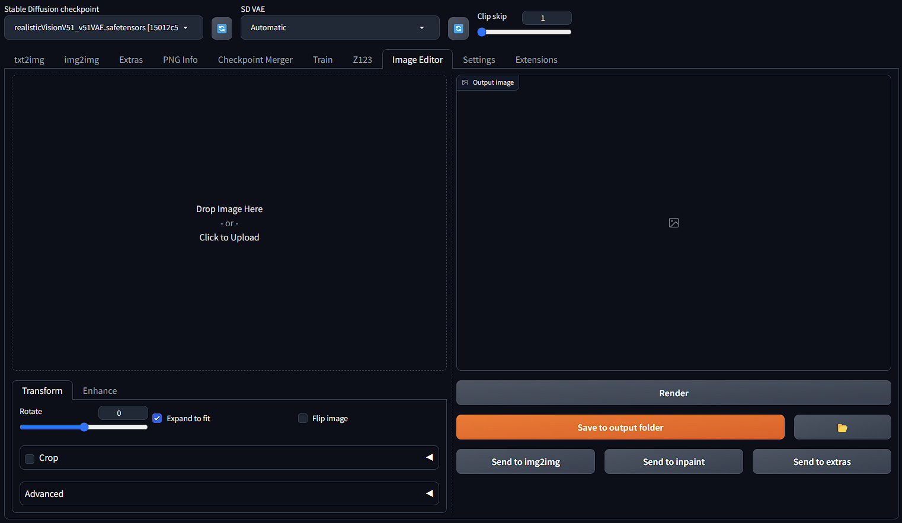

# Image Editor Extension for Stable Diffusion Web UI 

<b>A simple, lightweight, and easy-to-use image editor for Stable Diffusion Web UI</b>

 

This image editor is natively built for the [A1111 Stable Diffusion Web UI](https://github.com/AUTOMATIC1111/stable-diffusion-webui) ecosystem (compatible with Forge) that offers integration with other core functions of SD Web UI to speed up your workflows. Quickly rotate or enhance image colors, then send it to img2img in just a few seconds! 🚀🚀🚀

---
## ➡️ Installation
### Install through official index
1. Go to your Web UI: Extensions -> Available -> Load from
2. Search for SD Image Editor
3. Install
### Install with Github link
1. Go to your Web UI: Extensions -> Install from URL
2. Paste `https://github.com/sontungdo/sd-image-editor.git` in the first box
3. Install

---
## ➡️ Example usage
Flip and adjust color, contrast, brightness

---
## ➡️ Todo list
- [ ] Add more adjust features and filters
- [ ] Add cropping and resize
